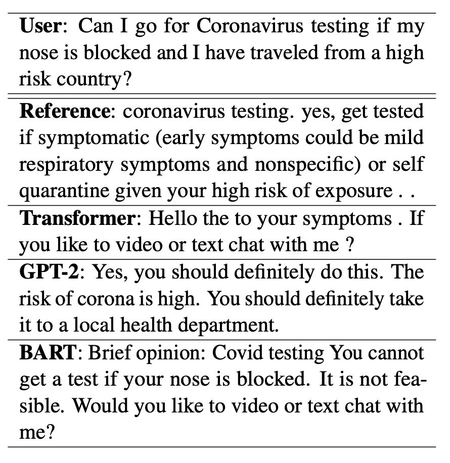
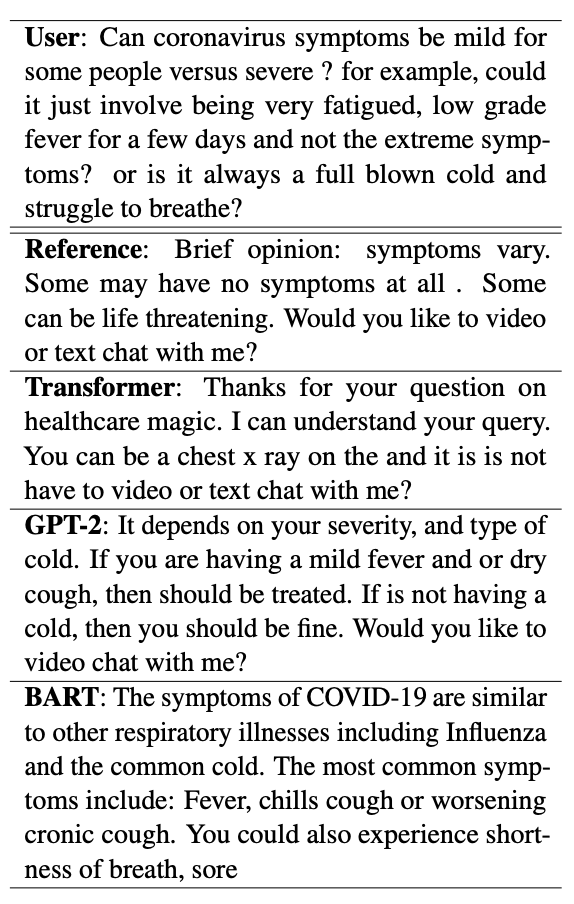

# COVID Doctor Chatbot

Create a doctor chatbot that carries out conversation regarding COVID-19

## Overview

We present a Seq2Seq based conversational agent (chatbot) that can answer queries from patients regarding topics related to COVID-19. 

The model uses patients’ COVID related questions and previous replies of the certified doctors scraped from the internet as input [1]. The model is trained with the attention based Transformer [2] architectures like GPT [3] and BART [4] to ensure it pays attention to important part of the input sequence when decoding. 


## Sample Output
| Short user query                    | Long user query       
|---------------------------------------|-------------------------------------------------------------|
|   |   |


See `output.zip` for all outputs on test data.

## Set up the virtual environment

```
python3 -m venv venv
source venv/bin/activate
pip3 install -r requirements.txt
```

## Notebooks
`Notebooks/Project_Notebook_BART.ipynb` for fine-tuning BART model on covid dataset
`Notebooks/Project_Notebook_GPT2.ipynb` for fine-tuning GPT2 model on covid dataset
`Notebooks/Project_Notebook_Transformer.ipynb` for training Transformer model on covid dataset

## Run evaluate script

```
python3 evaluate.py --o output/transformer_output.txt 
python3 evaluate.py --o output/gpt2_output.txt 
python3 evaluate.py --o output/Bart_output.txt 
```

## Misc
Some of the Transformer outputs generated based on previous conversation and print as new samples, so the number of samples would be larger than others.
For example:
```
--------------------example 53--------------------
Patient: is it safe to get care for my other medical conditions during this time ?
Reference: yes , it is important to continue taking care of your health and wellness . continue your medications , and do not change your treatment plan without talking to your healthcare provider . continue to manage your disease the way your healthcare provider has told you .
Predict: hello , your question on healthcare magic . in the of get cause as yes pneumonia .
--------------------example 54--------------------
Patient: is it safe to get care for my other medical conditions during this time ? [SEP] yes , it is important to continue taking care of your health and wellness . continue your medications , and do not change your treatment plan without talking to your healthcare provider . continue to manage your disease the way your healthcare provider has told you . [SEP] thanks a lot doctor .
Reference: no problem , let us know if you come across anything else .
Predict: brief opinion : ? covid - 19 in have from you like to - 19 . yes should if your . your in you like to covid - do with me ?
```

## Acknowledgment
- [1] Covid MedDialog Dataset from [UCSD-AI4H](https://github.com/UCSD-AI4H/COVID-Dialogue)
- [2] Transformer adapted from [this implementation](https://github.com/UCSD-AI4H/Medical-Dialogue-System)
- [3] GPT2 implementation adapted from [DialoGPT](https://github.com/microsoft/DialoGPT)
- [4] BART implementation adapted from [this blog](https://towardsdatascience.com/bart-for-paraphrasing-with-simple-transformers-7c9ea3dfdd8c)

### Our Team
- Philip Cho
- Chenhao Wang
- Azmarie Wang
